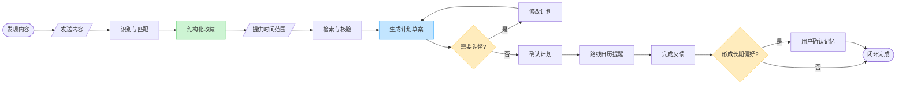
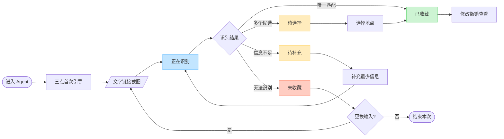
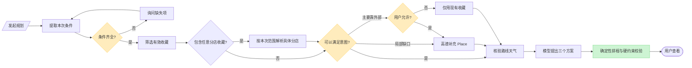
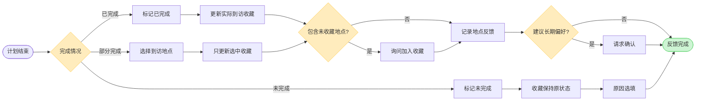
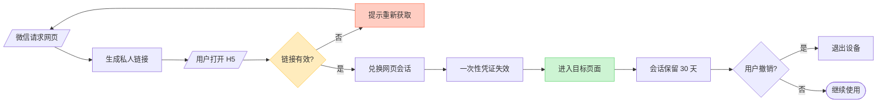
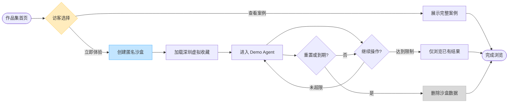

# 拾光｜核心用户流程 v1.0

| 文档项 | 内容 |
|---|---|
| 产品 | 拾光｜把收藏变成行动的个人生活 Agent |
| 文档类型 | 核心用户流程与低保真原型输入 |
| 版本 | v1.0 |
| 日期 | 2026-07-20 |
| 状态 | 已确认 PRD 的流程化表达 |
| 适用范围 | 深圳首版；Web/H5 先行，微信 ClawBot 后接 |
| 上游文档 | `拾光_PRD_v1.0.md` |

---

## 1. 文档目的

本文档把 PRD 中已经确认的规则整理为可执行的用户流程，用于：

- 制作移动端和桌面端低保真原型；
- 对齐前端页面、后端状态和 Agent 行为；
- 编写端到端测试与 Agent 评测场景；
- 控制 MVP 范围，防止在原型和开发阶段继续增加功能。

本文不重新讨论产品定位、技术选型和商业模式。若本文与 PRD 冲突，以 PRD 中最新版本记录为准。

## 2. 角色、端与数据范围

### 2.1 用户角色

| 角色 | 说明 | 主要入口 |
|---|---|---|
| 真实用户 | 在校大学生或年轻职场人，管理自己的收藏与计划 | Web/H5、微信 ClawBot |
| Demo 访客 | 无需登录，使用深圳虚拟数据体验作品集 | 公开 Web Demo |
| 分享接收者 | 无需登录，只读查看一份已确认计划 | 计划分享 H5 |

### 2.2 一级导航

移动端使用四项底部导航，桌面端使用语义一致的侧边导航：

1. **Agent**：默认首页，完成输入、收藏、查询、规划、调整和确认；
2. **收藏**：管理 Place、Event、待选择和待补充内容；
3. **计划**：管理草案、已确认计划、历史版本和完成状态；
4. **我的**：管理记忆、提醒、登录设备与数据。

Agent 工作过程不是一级导航。真实用户在消息或计划详情中按需展开；Demo 访客可以通过独立入口查看。

## 3. 全局流程原则

1. **收藏优先**：先使用用户收藏，收藏无法满足本次意图时才补充外部 Place；
2. **必要信息最少化**：规划只强制要求空闲时间和活动范围；
3. **默认可逆**：自动收藏、草案和文件均提供修改、撤销或版本；
4. **不确定即标记**：价格、营业时间、位置和活动状态不确定时明确展示；
5. **草案不等于执行**：用户确认计划后才生成正式执行入口；
6. **计划确认不等于收藏**：外部 Place 只有在用户明确“加入收藏”后才写入收藏库；
7. **临时要求不进入长期记忆**：Agent 推断偏好必须经用户确认；
8. **主动触达需要授权**：提醒默认对单份计划单次授权；
9. **Web 与微信动作一致**：两端共用状态、数据和业务动作，只改变呈现方式；
10. **Demo 与真实数据隔离**：匿名沙盒不得访问真实用户数据或执行外部写操作。

## 4. 核心闭环总览

## 5. UF-01 首次进入与内容提交

### 5.1 目标

用户在 3 分钟内完成第一次有效收藏，并理解拾光支持的输入、数据用途和可撤销操作。

### 5.2 入口

- Web/H5 Agent 首页；
- 微信 ClawBot 对话；
- Demo 首页“立即体验”。

### 5.3 首次引导

首次进入只传达三件事：

1. 拾光可以把想去的地点或活动整理成可规划收藏；
2. 当前计划城市为深圳，但可以先收藏其他城市的地点与活动；
3. 用户可以发送普通文字、文本 URL 或截图。

不要求填写职业、年龄、预算、课程表、精确住址或完整兴趣问卷。

### 5.4 主流程

### 5.5 四类结果

| 结果 | 用户文案重点 | 数据结果 | 可用操作 |
|---|---|---|---|
| 已收藏 | 标题、城市分类/线索、区域、类型、费用与待核验项 | 创建有效 CollectionItem | 修改、撤销、查看收藏、继续添加 |
| 待选择 | 已记录，但位置尚未确定 | 创建待选择 CollectionItem | 从最多 3 个 POI 中选择 |
| 待补充 | 已记录，说明缺少什么 | 创建待补充 CollectionItem | 补充区域、商圈、地标或地图链接 |
| 未收藏 | 说明失败原因和可恢复方式 | 不创建 CollectionItem | 补充文字、改发截图或结束 |

### 5.6 页面要求

- 提交后立即显示“正在识别”，防止重复发送；
- 处理中不提前显示“收藏成功”；
- 成功卡片同时显示已确认字段和待核验字段；
- “修改”和“撤销”必须在首屏可见；
- 只有一条收藏时，不强迫用户立即发起完整计划；
- Web 使用按钮，微信使用数字选项和自然语言。

### 5.7 验收场景

1. 从深圳地点截图完成唯一匹配并自动收藏；
2. 只输入连锁品牌名称，进入待选择；
3. 只输入过于通用的店名，进入待补充；
4. 输入菜谱或跨城多日行程，明确提示不在 MVP 范围；
5. 输入明确广州地点时正常形成收藏，不因当前计划城市是深圳而拒绝；
6. 链接无法访问时只重试一次，随后转截图兜底。

## 6. UF-02 地点匹配与分店消歧

### 6.1 触发条件

- 只识别出店名；
- 高德返回多个同名 POI；
- 连锁品牌在原文城市范围或默认搜索城市中存在多家分店；
- 原文区域与候选地址冲突；
- 匹配置信度低于业务阈值。

### 6.2 处理规则

1. Agent 综合店名、行政区、商圈、地标、地铁站、电话、地点类型和原文上下文；
2. 最多展示 3 个高概率候选；
3. “高德排序第一”不等于匹配成功；
4. 用户选择后记录确认来源和 POI ID；
5. 待选择和待补充条目可以保留在收藏库，但不能进入正式计划；
6. 连锁品牌的不同分店视为不同 Place；
7. 用户可以明确选择“任意分店都可以”；此时保存一条有效的品牌级收藏，不为候选分店批量创建收藏。

### 6.3 候选卡片字段

- 完整名称与分店名；
- 行政区、商圈和公开地址；
- 距离参考；
- POI 类型；
- 与原内容相符的线索；
- “以上都不是”入口。

### 6.4 “以上都不是”处理

- 保留原店名与来源；
- 状态变为待补充；
- 只询问一个最有区分度的信息；
- 用户可选择暂时保留或撤销收藏。

### 6.5 “任意分店都可以”处理

- 该选项必须由用户明确选择，不能根据没有地址的店名自动推断；
- 收藏从待选择转为有效的“任意分店”地点目标，保留品牌名、来源和查询证据；
- 当前最多展示或缓存 3 个候选分店，但它们不是独立收藏；
- 规划时结合本次活动范围重新解析具体分店，并在草案中展示分店、地址、路线增量和选择原因；
- 用户若一次选择多个具体分店，则分别创建收藏并共享原始 Source；
- 到访只记录实际分店，不自动完成或删除品牌级收藏。

## 7. UF-03 从收藏发起计划

### 7.1 入口

- Agent 自然语言：“周六下午 2 点到 6 点在南山，帮我安排一下”；
- Agent 首页快捷操作“帮我安排”；
- 收藏库多选后“用这些收藏规划”；
- 主动计划询问后的用户回复。

Agent 自然语言是主入口，收藏库多选是辅助入口，两者复用同一计划工作流。多选收藏默认优先；只有明确标记后才是必须安排项。

### 7.2 必填与选填

| 类型 | 字段 | 缺失时行为 |
|---|---|---|
| 必填 | 连续空闲时间段 | 只询问什么时候有空 |
| 必填 | 活动范围或出发区域 | 只询问想在哪个区域活动 |
| 选填 | 预算 | 不询问也可继续；必须展示费用 |
| 选填 | 同行人 | 不阻塞 |
| 选填 | 交通偏好 | 不阻塞 |
| 选填 | 本次特殊要求 | 解析后作为本次约束 |

### 7.3 条件确认卡

Agent 在调用规划工具前展示本次条件：

> 时间：周六 14:00–18:00  
> 范围：深圳南山区  
> 预算：未设置  
> 其他要求：轻松一点

用户可以直接继续，也可以自然语言修正。条件明确时不增加一次强制“确认条件”点击。

### 7.4 规划主流程

### 7.5 收藏候选过滤顺序

1. 正式城市与本次 Plan 城市一致；当前 MVP 的 Plan 城市固定为深圳；
2. 精确 Place 已匹配；任意分店收藏已为本次计划解析到具体 Place；Event 尚未结束；
3. 满足用户时间和明确预算上限；
4. 路线可在时间内完成；
5. 满足用户明确排除项；
6. 将硬过滤后的脱敏候选与已知事实交给模型提出组合、顺序和建议停留时长。

### 7.6 计划密度

- 空闲时间是上限，不要求全部填满；
- 模型决定候选组合、顺序和建议停留时长，不固定每项一小时，不限制每个方案只包含两个地点；
- 每次地点切换预留约 10–20 分钟；
- 结束前保留约 15–30 分钟；
- 不能仅因有剩余时间就外部检索；
- 支持“排满一点”“轻松一点”“只去一个地方”等调整。

## 8. UF-04 收藏不足与外部 Place 补充

### 8.1 判断原则

“收藏不足”不按收藏条数判断，而是判断过滤硬约束后，现有收藏能否满足本次意图并组成可执行计划。

| 情况 | Agent 行为 | 是否先授权 |
|---|---|---|
| 收藏可完成计划 | 不调用高德外部补充 | 否 |
| 有核心收藏但缺必要环节 | 自动只读检索少量 Place | 否 |
| 无符合条件收藏 | 询问是否使用高德推荐 | 是 |
| 计划主要由外部 Place 构成 | 询问是否使用高德推荐 | 是 |
| 缺少用户指定的 Event | 提示添加活动或改为固定地点 | 不执行外搜 |

### 8.2 外部 Place 草案规则

- 可直接进入计划草案；
- 必须标记“高德补充 · 未收藏”；
- 提供替换、删除、加入收藏；
- 确认计划不等于加入收藏；
- 同名分店或匹配不确定时必须先消歧；
- 价格、营业时间缺失时显示“待确认”；
- 不将美术馆或剧院推断成具体展览、演出等 Event。

### 8.3 用户拒绝外部推荐

Agent 提供两个可恢复选择：

1. 仅使用现有收藏生成简单计划；
2. 继续添加收藏后再规划。

不得反复请求相同授权，也不得偷偷调用外部推荐后隐藏来源。

## 9. UF-05 计划草案、调整与确认

### 9.1 草案结构

初次生成恰好 3 个方案：第一个是最符合用户原始要求和节奏的主方案，后两个是不预设固定风格的备选。每个方案展示：

- 时间线与预计停留；
- 交通方式、路线时间和缓冲；
- 单项与总费用区间；
- 收藏来源或外部来源；
- 天气、营业、预约和价格风险；
- 最后查询时间；
- 选择理由与主要排除原因；
- 确认、调整、查看备选入口。

### 9.2 自然语言调整

示例：

> 不要咖啡店，换成适合散步的地方，其他不变。

Agent 必须：

1. 保留时间、范围和所有未被修改的条件；
2. 重新筛选与算路；
3. 生成新的草案版本；
4. 说明替换项、时间和费用变化；
5. 不静默覆盖已确认版本。

### 9.3 确认后的动作

用户确认计划后：

- 计划状态从草案变为已确认；
- 生成一份覆盖整段计划的 `.ics` 文件；
- 提供各段高德地点和路线入口；
- 询问是否创建出发前 60 分钟提醒；
- 外部 Place 仍保持未收藏；
- 不自动购票、预订或写入第三方日历。

### 9.4 已确认计划再次修改

- 创建新版本，不覆盖原版本；
- 重新执行路线、天气和硬约束校验；
- 用户重新确认后，新版本才成为当前执行版本；
- 关联提醒同步调整，并展示新的触发时间；
- 分享页只同步最新已确认版本，草案修改不可见。

## 10. UF-06 计划执行、提醒与反馈

### 10.1 行前提醒

- 默认对当前计划单次授权；
- 默认建议出发前 60 分钟；
- 用户可修改或取消；
- 取消或删除计划时同步取消；
- 行前核验发现变化时提示风险和“重新规划”，不静默修改；
- 微信发送失败时在 Web/H5 显示真实状态。

### 10.2 完成反馈流程

### 10.3 数据更新矩阵

| 用户反馈 | Plan | PlanStop | 已收藏地点 | 外部未收藏地点 |
|---|---|---|---|---|
| 已完成 | 已完成 | 实际到访项完成 | 更新为去过 | 只记录到访，可询问收藏 |
| 部分完成 | 部分完成 | 用户选中的项完成 | 仅选中项更新为去过 | 仅更新 PlanStop |
| 未完成 | 未完成 | 未完成 | 保持原状态 | 不创建收藏 |

完成状态允许更正；更正后重新计算相关状态并保留操作记录。

## 11. UF-07 长期记忆与临时约束

### 11.1 写入判断

| 用户表达 | 处理方式 | 示例 |
|---|---|---|
| 明确长期指令 | 直接写入并告知可删除 | 记住我不吃日料 |
| 明确本次要求 | 只作为临时约束 | 这次不要日料 |
| 单次地点反馈 | 保存地点反馈 | 这家店太吵 |
| Agent 行为推断 | 只提出建议 | 可能偏好安静空间 |
| 动态事实 | 不写入长期记忆 | 今天下雨 |
| 精确敏感位置 | 不自动保存 | 家庭详细地址 |

### 11.2 推断偏好确认

Agent 必须展示从什么反馈或行为得出建议，并询问：

> 要记住“以后优先推荐安静的地点”吗？

只有用户确认后才写入。拒绝后不重复使用相同证据频繁询问。

### 11.3 记忆管理

用户在“我的—记忆中心”可以：

- 查看内容、来源、创建时间和最后使用时间；
- 查看某条记忆影响了哪些计划；
- 修改、删除或禁止某类记忆；
- 删除后立即停止在新任务中加载。

## 12. UF-08 微信进入 Web/H5

### 12.1 触发

- 用户回复“打开网页版”；
- 点击消息中的“查看收藏详情”；
- 点击消息中的“查看计划详情”。

### 12.2 登录流程

### 12.3 安全与体验规则

- 私人链接 10 分钟有效且只能成功使用一次；
- 一次性凭证兑换后从 URL 和长期会话中分离；
- 登录状态默认 30 天；
- 用户可以撤销当前或全部网页设备；
- Web 与微信关联同一内部 `user_id`；
- MVP 不开发手机号密码和微信网页 OAuth；
- 私人登录令牌不能兑换计划分享权限，分享令牌不能兑换登录权限。

## 13. UF-09 已确认计划分享

### 13.1 生成流程

1. 用户在已确认计划详情点击“分享计划”；
2. 系统展示脱敏预览；
3. 用户确认后生成随机、不可枚举的只读链接；
4. 接收者无需登录查看；
5. 用户可以随时关闭；
6. 链接在计划结束 7 天后失效。

### 13.2 默认展示与隐藏

| 默认展示 | 默认隐藏 |
|---|---|
| 日期、时间线 | 用户姓名与微信身份 |
| 地点名称与公开地址 | 精确家庭、学校或工作起点 |
| 交通、缓冲和费用 | 原始收藏来源链接与私人备注 |
| 风险与查询时间 | 完整收藏库与长期记忆 |
| 高德地点与路线入口 | Agent 对话与授权记录 |
| 最新确认版本和更新时间 | 未入选候选与未确认草案 |

精确私人起点默认降级为区级或商圈级描述。

### 13.3 版本变化

- 草案变化不影响分享页；
- 新版本确认后分享页同步更新并显示更新时间；
- 计划取消后分享页显示“计划已取消”；
- 分享关闭或到期后只显示失效状态，不泄露原计划内容。

## 14. UF-10 公开 Demo

### 14.1 进入路径

### 14.2 预置内容

约 8–10 条深圳虚拟收藏，至少覆盖：

- 稳定 Place；
- 有效 Event；
- 已过期 Event；
- 待选择的同名分店；
- 待补充收藏；
- 收藏不足时由高德补充 Place 的示例。

### 14.3 允许与禁止

| 允许 | 首个公开版本禁止 |
|---|---|
| 使用内置文字与截图样例 | 任意网址抓取 |
| 收藏、修改、撤销、消歧 | 访客私人截图上传 |
| 生成、调整、确认计划 | 真实微信绑定 |
| 查看 Agent 工具过程 | 主动提醒和外部消息 |
| 下载演示日历、打开路线 | 永久保存与真实用户数据访问 |
| 手动完成反馈 | 自动购票或预订 |

### 14.4 成本与清理

- 每个会话约 10 轮 Agent 操作；
- 深圳 POI、天气和路线优先使用缓存；
- 会话和 IP 均执行频率限制；
- 超限后仍可浏览结果；
- 沙盒默认保留 2 小时，可主动重置；
- 只记录匿名事件，不记录访客输入正文。

## 15. 全局异常与恢复

| 异常 | 用户可见状态 | 自动处理 | 用户下一步 |
|---|---|---|---|
| 链接无法访问 | 页面受限 | 最多重试一次 | 发送截图或补充文字 |
| 图片无法识别 | 识别失败 | 保留导入任务结果 | 补充店名或重新上传 |
| POI 多义 | 待选择 | 返回最多 3 个候选 | 选择或以上都不是 |
| POI 无结果 | 待补充 | 保留来源和标题 | 补充区域、商圈或地图链接 |
| 收藏无可用候选 | 无匹配收藏 | 说明排除原因 | 授权高德或继续添加收藏 |
| Event 缺失 | 无有效活动 | 不执行外部 Event 检索 | 添加活动或改为固定地点 |
| 高德失败 | 地点或路线暂不可用 | 有限重试并记录失败 | 使用现有信息或稍后重试 |
| 天气失败 | 天气待确认 | 不编造 | 保留风险提示 |
| 模型输出不符合 Schema | 生成失败 | 自动修复一次 | 恢复条件并重新生成 |
| 提醒发送失败 | 发送失败/待查看 | 保留 Web 待办 | 在 Web 查看计划 |
| 分享链接失效 | 已失效 | 不返回原计划 | 联系分享者重新生成 |

异常处理必须保留已输入条件，避免用户从头重复填写。

## 16. 核心状态映射

### 16.1 导入任务状态

| 状态 | 含义 | 是否已创建收藏 |
|---|---|---|
| processing | 正在识别或匹配 | 否 |
| resolved | 已形成有效收藏 | 是 |
| needs_selection | 存在多个地点候选 | 是，待选择 |
| needs_input | 信息不足 | 是，待补充 |
| failed | 无法识别或不在范围 | 否 |

### 16.2 计划状态

| 状态 | 用户含义 | 可执行动作 |
|---|---|---|
| draft | 可调整的计划草案 | 修改、查看备选、确认、删除 |
| confirmed | 当前执行版本 | 路线、日历、提醒、分享、反馈 |
| completed | 已完成 | 查看、评价、再次规划 |
| partially_completed | 部分完成 | 补充反馈、更正状态 |
| not_completed | 未完成 | 记录原因、重新规划 |
| cancelled | 已取消 | 查看历史、复制为新计划 |

### 16.3 分享状态

| 状态 | 分享页行为 |
|---|---|
| active | 展示最新已确认版本 |
| cancelled_plan | 显示计划已取消 |
| revoked | 显示分享已关闭 |
| expired | 显示链接已失效 |

## 17. 页面与流程映射

| 页面 | 主要流程 | 关键状态/组件 |
|---|---|---|
| Agent 首页 | UF-01、UF-03 | 首次引导、输入框、快捷操作、会话卡片 |
| Agent 对话与收藏结果 | UF-01、UF-02 | 识别中、已收藏、待选择、待补充、失败 |
| 收藏库 | UF-01、UF-02 | 城市分类/筛选、城市待确认、状态分组、待处理数量、批量仅查看；具体交互后续设计 |
| 收藏详情 | UF-02、UF-07 | 字段来源、编辑、消歧、状态、删除 |
| 计划草案 | UF-03、UF-04、UF-05 | 条件卡、时间线、来源、风险、备选、确认 |
| 已确认计划 | UF-05、UF-06、UF-09 | 路线、日历、提醒、分享、版本、反馈 |
| 我的 | UF-07、UF-08 | 记忆、提醒设置、登录设备、数据管理 |
| 只读分享页 | UF-09 | 脱敏计划、更新时间、路线、失效状态 |
| 作品集首页 | UF-10 | 产品价值、案例、立即体验 |
| 桌面 Agent + 计划 | UF-03、UF-05、UF-10 | 对话、计划详情、Agent 工作过程 |

## 18. 低保真原型帧清单

### 18.1 移动端 8 页

1. Agent 首页；
2. Agent 对话与收藏结果；
3. 收藏库；
4. 收藏详情与地点消歧；
5. 计划草案；
6. 已确认计划与执行入口；
7. 我的与记忆/提醒/设备设置；
8. 脱敏只读分享页。

### 18.2 桌面端 2 页

1. 作品集介绍与公开 Demo 入口；
2. 桌面 Agent + 计划详情组合页。

### 18.3 必须制作的状态变体

- 收藏：识别中、已收藏、待选择、待补充、失败；
- 计划：生成中、空结果、外部授权、草案、已确认、工具失败；
- 反馈：已完成、部分完成、未完成；
- 分享：有效、计划已取消、已关闭、已失效；
- Agent 过程：成功、部分工具失败、整体失败降级。

## 19. 埋点与流程指标

| 流程 | 核心事件 | 主要指标 |
|---|---|---|
| 首次收藏 | import_submitted、collection_created | 首次收藏完成率与耗时 |
| 消歧 | poi_candidates_shown、poi_selected | 正确匹配率、平均选择次数 |
| 规划 | plan_requested、plan_draft_created | 草案生成成功率与耗时 |
| 外部补充 | external_permission_requested、external_place_added | 授权率、外部补充占比 |
| 调整确认 | plan_revised、plan_confirmed | 平均修改轮数、确认率 |
| 执行 | route_opened、ics_downloaded、reminder_created | 计划到行动转化 |
| 反馈 | plan_feedback_submitted | 已完成、部分完成、未完成占比 |
| 记忆 | memory_suggested、memory_confirmed、memory_deleted | 建议接受率与纠正率 |
| 分享 | share_created、share_opened、share_revoked | 分享创建与打开率 |
| Demo | demo_started、demo_limit_reached、demo_reset | Demo 核心闭环完成率 |

埋点不得记录用户输入正文、模型思维链、密钥、私人地址或未经脱敏的工具参数。

## 20. 端到端验收链路

### 20.1 主链路

1. 从一张深圳地点截图创建收藏；
2. 修改一个结构化字段；
3. 撤销并重新收藏；
4. 输入“周六 14:00–18:00，南山区”；
5. 从收藏生成主方案；
6. 将条件改为“少走路，不要日料”；
7. 确认计划；
8. 下载日历并打开高德路线；
9. 设置单次提醒；
10. 标记部分完成并选择实际到访地点；
11. 确认或拒绝长期偏好建议。

### 20.2 分支链路

1. 明确其他城市地点正常收藏，并在收藏库按城市查看；深圳计划不会读取该条目；
2. 只有名称中的城市词时保持城市待确认，不静默确认或拒绝；
3. 同名店触发最多 3 个候选并完成选择；
4. 用户选择“任意分店都可以”，只形成一条品牌级收藏，并在规划时解析到范围内具体分店；
5. 收藏不足时局部自动补充高德 Place；
6. 计划主要依赖外部地点时先请求授权；
7. 缺少 Event 时不调用外部活动搜索；
8. 分享已确认计划并验证脱敏字段；
9. 关闭分享后原链接不能读取计划；
10. 私人登录链接过期或二次使用时拒绝访问；
11. Demo 达到调用上限后仍可浏览已有结果。

## 21. 本轮不进入原型的能力

- 收藏库城市分类和“城市待确认”的最终组件、排序与空状态样式（先确定数据与流程，后续调整界面）；
- 运行时切换计划城市；
- 跨城与多日旅行；
- 多人协作、评论与共同编辑；
- 任意平台收藏夹批量导入；
- 小红书全站内容搜索；
- 外部 Event 自动发现；
- 自动购票、预订和支付；
- 第三方日历直接写入；
- 手机号密码体系和微信网页 OAuth；
- 公共推荐信息流与达人社区；
- 独立向量数据库与复杂多 Agent 编排。

## 22. 下一步

1. 根据本文制作移动端 8 页、桌面端 2 页低保真原型；
2. 先连接“首次收藏 → 发起规划 → 调整确认 → 路线/日历 → 完成反馈”主链路；
3. 再补地点消歧、外部授权、提醒、分享和 Demo 限制状态；
4. 使用本文第 20 节验收链路走查原型；
5. 原型确认后，再确定视觉方向并进入高保真设计或 M0 技术验证。
