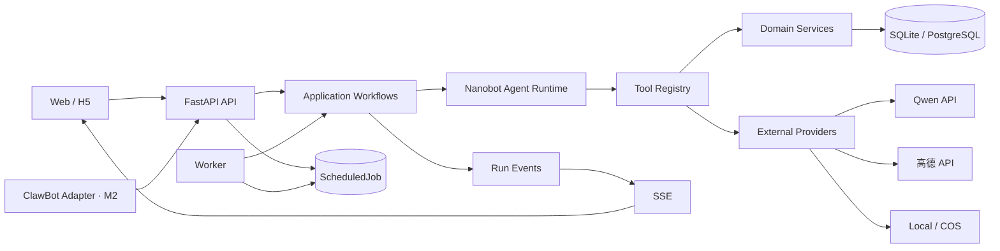

# 拾光｜MVP 技术方案 v0.1

| 文档项 | 内容 |
|---|---|
| 产品 | 拾光｜把收藏变成行动的个人生活 Agent |
| 文档类型 | MVP 技术设计与开发实施方案 |
| 版本 | v0.1 |
| 日期 | 2026-07-20 |
| 状态 | M0 开发基线 |
| 上游文档 | `拾光_PRD_v1.0.md`、`拾光_核心用户流程_v1.0.md` |
| 设计基线 | [拾光 UX/UI HTML 评审原型](../../prototypes/ux/index.html) |

---

## 1. 文档目的

本文把已经确认的产品需求和 UX 原型转换为可以直接实施的技术方案，解决以下问题：

1. 第一版代码如何组织，避免个人项目过早复杂化；
2. Nanobot 的 Agent Loop、Tool Registry、Session 和 Memory 如何映射到拾光业务；
3. Web/H5 与未来微信 ClawBot 如何共用一套业务数据和动作；
4. 收藏、地点消歧、规划、确认与反馈如何落到状态机、数据库和 API；
5. M0 技术验证先做什么，达到什么标准后再进入 M1。

本文不重新讨论产品定位、视觉方向和商业模式。发生冲突时，以 PRD 的最新确认稿为准。

## 2. 当前实施边界

### 2.1 本阶段要完成

- 创建独立的 `shiguang` 产品代码库；
- 跑通模型 Provider 与 Tool Calling；
- 跑通文本、文本 URL、截图三种内容输入的最小链路；
- 跑通高德 POI 搜索、候选消歧和唯一地点确认；
- 用固定深圳数据跑通“收藏 → 检索 → 计划草案”；
- 验证结构化输出、工具失败、超时和幂等写入；
- 建立可以继续扩展到 M1 的数据库、测试和日志基础。

### 2.2 本阶段不做

- 不接微信 ClawBot；
- 不做手机号、密码、微信 OAuth 或复杂账号系统；
- 不做主动提醒和真实外部消息发送；
- 不接 Redis、Celery、向量数据库、PostHog 或 Langfuse；
- 不做动态活动外部检索；
- 不做微服务、原生 App、自动预订和支付；
- 不把现有 HTML 原型直接改造成正式前端。

## 3. 已确认技术决策

| 主题 | 结论 | 原因 |
|---|---|---|
| 总体架构 | 单仓库、模块化单体 | 个人开发成本低，仍能保持清晰边界 |
| Web/H5 | Next.js + TypeScript | 响应式单一代码库，便于作品集展示 |
| API | Python 3.11+ + FastAPI | 与 Agent、数据处理和现有学习代码一致 |
| Agent | 复用现有 Nanobot 核心思想并做业务适配 | 保留 Loop、Runner、Tool Registry 等核心价值 |
| 数据模型 | Pydantic + SQLAlchemy + Alembic | 统一接口校验、领域模型和迁移 |
| 数据库 | M0 SQLite，M1 PostgreSQL | 先快速验证，再使用正式数据能力 |
| 检索 | 结构化字段、标签和关键词 | MVP 暂不需要向量数据库 |
| 实时进度 | SSE | 单向状态推送足够，暂不需要 WebSocket |
| 后台任务 | PostgreSQL Job + Worker + APScheduler | 持久、可恢复，预留队列接口 |
| 外部 Place | 高德 Web 服务 API | 深圳 POI、路线和天气使用同一供应商 |
| 城市范围 | 收藏不限城市；MVP 计划固定深圳，后续可显式切换一个已开放计划城市 | 收藏与规划解耦，既保留未来兴趣，也避免把城市切换误做成跨城旅行 |
| 模型 | 阿里云百炼的 OpenAI 兼容接口 | 复用现有 Provider 边界，不写死模型细节 |
| 文件 | 本地私有目录，公开部署后使用 COS 私有桶 | 本地开发简单，生产环境保持私有 |
| 部署 | Docker Compose + Caddy | 统一 Mac、Windows/WSL2 与云服务器环境 |

## 4. 总体架构



### 4.1 分层职责

| 层 | 负责 | 不负责 |
|---|---|---|
| Channel | 把 Web/微信输入转换成统一消息 | 不判断业务规则，不维护第二套流程 |
| API | 鉴权、参数校验、响应与 SSE | 不直接拼 Prompt，不直接调用高德 |
| Application | 编排收藏、规划、确认等用例 | 不保存供应商特有实现 |
| Agent Runtime | 意图理解、受限工具循环、回复生成 | 不绕过权限和领域状态机 |
| Domain | 状态、规则、去重、约束、幂等 | 不依赖 FastAPI 或前端组件 |
| Tools | 给 Agent 暴露最小、可审计的能力 | 不暴露任意 SQL、任意网络和文件读写 |
| Providers | 封装模型、地图、存储等外部服务 | 不决定产品策略 |
| Infrastructure | 数据库、缓存、Job、日志实现 | 不包含用户可见文案 |

### 4.2 关键约束

- 前端只能调用 FastAPI，不能直接调用模型、高德或数据库；
- 模型不能生成或执行任意 SQL；
- 模型输出必须经过 Pydantic 校验和确定性业务规则校验；
- Web 与微信共用 `user_id`、状态机、工具和数据库；
- 只读工具可以自动执行，重要写操作由应用层检查授权；
- 原始模型思维过程不写入用户界面，只记录可解释的工具和规则结果。

### 4.3 收藏城市与计划城市边界

当前基础能力允许收藏不同城市的地点与活动，但 M0/M1 的计划、外部补充和 Demo 仍只启用深圳。收藏城市不是请求准入条件，抽取层不得维护“非深圳城市拒绝”正则或地标白名单。

- `city_hint` 是来自原文的可选城市线索，可为空、可由用户修改，不能单独作为正式规划条件；
- 正式城市由后续统一地点引用/POI 匹配或用户确认产生稳定 `city_code`，供应商 `adcode` 只在 MapProvider 适配层映射；
- Place/Event 标题、品牌名中的城市词不能自动确认或拒绝城市；缺少城市时进入“城市待确认”，不伪造深圳；
- 收藏库可以按正式城市分类和筛选；只有线索而未确认的条目统一进入“城市待确认”，不复制第二套收藏模型；
- `User` 的城市表示默认计划上下文，`city_hint`、收藏正式城市和 `Plan.city_code` 语义分离；
- 当前计划查询必须显式使用 `PlanConstraints.city_code=shenzhen` 并只选择同城、位置已确认且状态有效的收藏；供应商 `adcode` 不进入领域契约；
- 不使用进程级可变 `CURRENT_CITY`，也不修改 `AgentRunner`、`ToolRegistry`、`ModelProvider` 或 Web/微信共享应用层；
- 一条输入可产生不同城市的多个候选；跨城多日计划请求仍属于不支持的规划意图。

后续 U1 只负责开放其他计划城市和 Session 城市切换，不再承担“允许保存其他城市收藏”。启动 U1 前仍需 ADR 确认唯一 `CityCatalog`、启用城市、会话规则、历史数据和高德覆盖；当前不为此创建第二套 Provider、Repository 或业务流程。

## 5. 建议项目结构

现有 `nanobot/` 继续作为学习和参考代码，不在其中直接开发拾光。新建独立目录：

```text
shiguang/
├── backend/
│   ├── app/
│   │   ├── main.py
│   │   ├── config.py
│   │   ├── api/
│   │   │   ├── dependencies.py
│   │   │   └── routes/
│   │   ├── schemas/
│   │   ├── application/
│   │   │   ├── collect_content.py
│   │   │   ├── resolve_place.py
│   │   │   ├── generate_plan.py
│   │   │   ├── confirm_plan.py
│   │   │   └── submit_feedback.py
│   │   ├── domain/
│   │   │   ├── collections/
│   │   │   ├── places/
│   │   │   ├── plans/
│   │   │   ├── memories/
│   │   │   └── approvals/
│   │   ├── agent/
│   │   │   ├── loop.py
│   │   │   ├── runner.py
│   │   │   ├── context.py
│   │   │   ├── policies.py
│   │   │   └── prompts/
│   │   ├── tools/
│   │   │   ├── registry.py
│   │   │   ├── content/
│   │   │   ├── collections/
│   │   │   ├── maps/
│   │   │   ├── planning/
│   │   │   └── execution/
│   │   ├── providers/
│   │   │   ├── model.py
│   │   │   ├── map.py
│   │   │   ├── storage.py
│   │   │   └── jobs.py
│   │   ├── infrastructure/
│   │   │   ├── db/
│   │   │   ├── repositories/
│   │   │   ├── storage/
│   │   │   └── telemetry/
│   │   ├── channels/
│   │   │   ├── web.py
│   │   │   └── clawbot.py
│   │   └── worker/
│   ├── migrations/
│   ├── tests/
│   │   ├── unit/
│   │   ├── integration/
│   │   ├── contract/
│   │   └── evals/
│   └── pyproject.toml
├── frontend/
│   ├── app/
│   ├── components/
│   ├── features/
│   ├── lib/
│   └── tests/
├── docs/
│   ├── adr/
│   └── api/
├── infra/
│   ├── compose.yaml
│   └── Caddyfile
├── scripts/
├── .env.example
└── README.md
```

个人项目不需要为每个目录预先创建空文件。目录只在对应功能开始开发时增加。

## 6. Nanobot 核心的复用方式

### 6.1 保留的核心思想

1. `AgentLoop`：负责一次用户轮次、最小上下文加载和结果持久化；
2. `AgentRunner`：在“模型调用 → 工具执行 → 模型继续”之间受限循环；
3. `ToolRegistry`：集中注册、生成 Schema、校验与执行工具；
4. `Provider`：隔离具体模型厂商；
5. `Session`：保存短期上下文；
6. `Memory`：保存跨会话且经确认的长期偏好。

### 6.2 必须改造的部分

现有最小核心适合学习，但不能直接承担 C 端产品数据：

| 现有实现 | 拾光改造 |
|---|---|
| JSONL Session | 数据库 `sessions` + `messages`，按 `user_id` 隔离 |
| Markdown Memory | 结构化 `memories` 表，包含来源、确认和有效期 |
| 工具返回普通字符串 | 统一 `ToolResult`，包含状态、数据、来源、错误和可恢复动作 |
| 简单参数检查 | Pydantic 工具入参/出参 Schema |
| 所有工具同等可调用 | 按工作流建立工具白名单和权限策略 |
| 无运行记录 | 增加 `agent_runs`、`tool_runs` 和 `trace_id` |
| 无成本信息 | Provider 返回模型、Token、耗时和估算费用 |
| 无状态机 | 收藏、地点、计划、授权使用领域状态机 |

### 6.3 代码策略

- 将现有最小核心中通用的 Loop、Runner、Provider 和 Tool Registry 逻辑迁入新项目；
- 不把整个学习项目作为运行时依赖，也不使用 Git Submodule；
- 保留原项目许可证和来源说明；
- 业务实体与业务规则不写进通用 Runner；
- 通用核心改动必须有单元测试，避免后续微信适配破坏 Web 行为。

## 7. 统一消息与运行协议

### 7.1 InboundMessage

所有渠道先转换为同一个输入对象：

```json
{
  "message_id": "msg_01...",
  "user_id": "usr_01...",
  "session_id": "ses_01...",
  "channel": "web",
  "content_type": "text",
  "text": "帮我收藏深圳当代艺术与城市规划馆",
  "attachments": [],
  "client_timestamp": "2026-07-20T12:00:00+08:00",
  "idempotency_key": "web-msg-123"
}
```

`channel` 首版实现 `web` 和 `demo`，为 M2 预留 `clawbot`。业务层不能根据渠道复制一套规则。

### 7.2 AgentRun

每次需要模型或工具参与的任务创建一条 `AgentRun`：

```text
queued → running → waiting_user / succeeded / partially_succeeded / failed / cancelled
```

每条 Run 必须包含：

- `trace_id`；
- 用户、会话、触发消息；
- 意图和工作流；
- 当前状态和阶段；
- 模型、Token、费用与耗时；
- 错误码与可恢复动作；
- 开始、结束和最后更新时间。

### 7.3 SSE 事件

前端只展示产品可理解的阶段，不展示思维链：

| 事件 | 示例用途 |
|---|---|
| `run.started` | 显示“正在识别” |
| `stage.changed` | 读取内容、匹配地点、核验路线 |
| `tool.completed` | 展示“高德地点核对完成” |
| `approval.required` | 请求外部推荐或计划确认 |
| `result.updated` | 刷新收藏卡片或计划草案 |
| `run.completed` | 显示最终状态 |
| `run.failed` | 显示错误和恢复入口 |

SSE 事件必须包含递增 `sequence`，断线后可通过 `Last-Event-ID` 补发。

## 8. Agent 工作流

### 8.1 工作流路由

首版使用“模型理解 + 确定性工作流”，不让一个自由 Agent 处理所有任务：

```text
用户消息
  ↓
Intent Parser
  ├─ collect_content
  ├─ resolve_place
  ├─ search_collection
  ├─ generate_plan
  ├─ adjust_plan
  ├─ confirm_plan
  ├─ submit_feedback
  └─ manage_memory
        ↓
工作流专属工具白名单
        ↓
Pydantic 校验 + Domain Policy
        ↓
结果与下一步
```

模型负责理解自然语言和候选结构；工作流负责允许哪些工具、何时写库、是否需要授权以及结果状态。

### 8.2 单轮执行顺序

1. 校验身份、会话、幂等键和输入类型；
2. 建立 `AgentRun` 与 `trace_id`；
3. 识别本轮意图和必要结构字段；
4. 只加载本任务所需的会话、收藏和记忆；
5. 选择工作流和允许的工具；
6. 执行只读工具并校验结果；
7. 使用确定性规则检查城市、时间、预算、状态和权限；
8. 若需要授权，进入 `waiting_user`，不得提前执行；
9. 执行允许的写操作并记录幂等结果；
10. 生成用户回复、来源、不确定项和下一步；
11. 保存消息、Run、ToolRun 和产品事件。

### 8.3 工具循环限制

- 单次 Run 最多 8 次工具调用；
- 总执行时间不超过 60 秒；
- 相同工具和相同参数不得在同一 Run 中无理由重复；
- 网页、地图和模型调用设置独立超时；
- 达到上限时返回部分结果和恢复入口，不继续空转。

## 9. 核心状态机

### 9.1 收藏状态

```text
recognizing
  ├─ active
  ├─ pending_selection
  ├─ pending_details
  └─ failed（不创建有效收藏）

active → visited / archived / deleted
pending_selection → active / pending_details / deleted
pending_details → recognizing / deleted
```

规则：

- `active` 且精确 Place 已确认，或“任意分店”地点目标能在本次计划中解析为具体 Place，或 Event 信息满足条件，才可以进入正式计划；
- 删除先逻辑删除，立即从检索中排除；
- 撤销自动收藏使用短期 Undo Token，不影响同一地点的其他来源；
- 相同高德 POI 可以合并地点，但保留多个 Source。

### 9.2 POI 匹配状态

```text
unmatched → searching → matched
                    ├→ ambiguous
                    ├→ needs_context
                    └→ not_found
```

`matched` 必须记录 `poi_id`、GCJ-02 坐标、确认方式和核验时间。高德排序第一不能自动等同于用户确认。

### 9.3 计划状态

```text
generating → draft → confirmed → completed
                ├→ cancelled
                └→ superseded

confirmed → partially_completed / not_completed / cancelled
```

- 每次调整创建新版本，不原地覆盖已确认版本；
- 只有最新 `confirmed` 版本可生成正式分享、日历和路线入口；
- 修改时间、地点或路线后，状态回到 `draft` 并重新确认；
- 外部 Place 进入计划不等于进入收藏库。

### 9.4 授权状态

```text
pending → approved / rejected / expired / revoked
```

授权记录必须保存动作、对象、用户看到的确认内容、有效期和结果。相同场景被拒绝后不得在同一轮反复询问。

## 10. 核心数据模型

所有主键使用不可推测的字符串 ID；所有服务端时间存 UTC；前端按 `Asia/Shanghai` 展示。

### 10.1 M0 最小表

| 表 | 核心字段 |
|---|---|
| `users` | id、mode、default_plan_city、timezone、created_at |
| `sessions` | id、user_id、channel、status、summary、updated_at |
| `messages` | id、session_id、role、content_type、content、trace_id、created_at |
| `sources` | id、user_id、type、url、file_key、platform、parse_status、metadata_json |
| `collection_items` | id、user_id、kind、title、city_hint（nullable）、place_scope（exact / any_branch）、district、address、price、tags、status、version |
| `collection_sources` | collection_item_id、source_id、created_at |
| `poi_references` | id、collection_item_id、provider、poi_id、city_code、coordinates、match_status、confidence、confirmed_by、queried_at |
| `agent_runs` | id、trace_id、user_id、session_id、intent、workflow、status、usage_json、error_code |
| `tool_runs` | id、agent_run_id、tool_name、input_summary、status、output_summary、latency_ms、error_code |

M0-2 城市契约调整使用新的 `20260721_0004` 向前迁移：将用户字段明确为 `default_plan_city`，将 `collection_items.city` 调整为 nullable `city_hint`，移除收藏表“只能是 shenzhen”的检查约束，但保留用户默认计划城市的当前深圳约束。迁移既有 `shenzhen` 值时只把它视为历史线索，不提升为正式城市；downgrade 遇到旧结构无法表达的新城市数据时必须明确拒绝，不能静默改成深圳或删除数据。已经集成的 `0003` 不得改写。

### 10.2 M1 增加的表

| 表 | 核心字段 |
|---|---|
| `memories` | id、user_id、type、content、source、confirmation_status、expires_at |
| `plans` | id、user_id、status、version、parent_plan_id、constraints_json、summary、totals_json |
| `plan_items` | id、plan_id、collection_item_id、external_poi_json、start_at、end_at、cost_json、route_json、status |
| `approvals` | id、user_id、action、target_type、target_id、display_text、status、expires_at |
| `feedback` | id、plan_id、plan_item_id、completion_status、reason、rating、memory_suggestion_id |
| `scheduled_jobs` | id、job_type、run_at、status、attempts、idempotency_key、payload_json |
| `product_events` | id、event_name、user_id、session_id、properties_json、created_at |
| `share_links` | id、plan_id、token_hash、status、expires_at、revoked_at |

### 10.3 JSON 字段原则

- 稳定且用于筛选的字段使用独立列；
- 供应商原始响应、可变约束和展示快照可以使用 JSON；
- JSON 中的数据不能替代用户隔离、状态、版本和时间字段；
- API 不直接返回完整供应商原始响应。

## 11. 内容导入与地点消歧

### 11.1 标准流水线

```text
接收输入
  → 保存 Source
  → 获取正文或图片
  → 提取 Place/Event 候选
  → 校验内容类型并保留可选 city_hint
  → Place 按显式城市线索或默认搜索上下文调用高德候选搜索
  → 计算匹配证据
  → active / pending_selection / pending_details / failed
  → 保存结果并返回可逆操作
```

城市字段规则：

- 抽取候选只保存 `city_hint: str | null`，不再使用只包含深圳的枚举限制候选，也不返回 `OUT_OF_SCOPE_CITY`；
- 明确广州、上海等单个地点或活动是合法收藏候选；`深圳到广州三日游` 等规划请求仍按不支持意图区分；
- `search_scope_city` 不持久化在候选或 CollectionItem 中，地点搜索范围由应用用例根据显式 `city_hint`、用户补充或当前默认计划城市传给唯一 MapProvider；
- `collection_items.city_hint` 只供展示、补充和初步城市分类，不参与正式计划硬过滤；正式 `city_code` 只从统一地点引用或用户确认读取；
- 在 M0-3 尚未建立正式地点引用前，其他城市收藏和城市不明确收藏可以保存，但不得错误标记为深圳或进入正式计划。

### 11.2 匹配证据

匹配评分使用可解释字段，不只使用高德返回顺序：

- 名称和分店名；
- 行政区与商圈；
- 地址、地标和地铁站；
- 电话；
- POI 类型；
- 原文或截图中的上下文。

阈值不在 Prompt 中硬编码，放在服务端配置。低于唯一匹配阈值时最多返回 3 个候选供用户选择。

### 11.3 连锁品牌与地点目标

Place 收藏使用一套统一地点目标契约，不另建“品牌收藏”和“分店收藏”两套业务模型：

```text
PlaceTarget
  ├─ exact       → 绑定一个已确认的具体 POI
  └─ any_branch  → 用户确认接受同一品牌中满足本次范围的任意分店
```

- `pending_selection` 表示用户尚未决定具体分店，也没有授权任意分店；`active + any_branch` 表示用户已经确认灵活分店策略；
- `any_branch` 只保存一条 CollectionItem；候选分店继续复用统一 POI 候选/引用契约，不建立 `BranchCandidate`、`BranchRepository` 或第二套收藏状态机；
- 候选列表是带 `queried_at` 的可刷新快照，默认最多展示 3 个，不把所有供应商结果永久复制进收藏；
- 用户明确多选具体分店时，为每个具体 POI 建立独立 CollectionItem，并复用同一 Source；
- 品牌归一、候选评分和具体分店匹配统一归属 `app/domain/places`，应用层只编排，不在抽取、API 或计划模块复制算法；
- 名称相似不足以证明同一品牌；无法稳定归组时保持待选择或待补充。

### 11.4 去重与幂等

- 接收消息以 `channel + message_id` 去重；
- 写收藏使用 `user_id + idempotency_key` 防止重复；
- 已确认的相同 `provider + poi_id` 优先关联现有 Place；
- 同一用户对已确认同一品牌身份重复选择 `any_branch` 时复用已有品牌级收藏；只有名称相似但品牌身份未确认时不得自动合并；
- URL 相同不是地点相同的充分条件；
- 连锁品牌不同 `poi_id` 视为不同地点。

### 11.5 规划时分店解析

- 规划检索遇到 `any_branch` 收藏时，复用同一 MapProvider 和地点匹配服务，按计划城市、活动范围、路线和时间解析具体分店；
- 解析结果只写入当前 PlanItem 的具体 POI 与查询快照，不把品牌级收藏永久改绑，也不自动新增分店收藏；
- 该分店属于收藏派生结果，来源指向品牌级 CollectionItem，不计入“外部补充 Place”；
- 若解析出的具体 POI 已有精确分店收藏，计划只生成一个 PlanItem，并合并品牌级与精确收藏来源说明；
- 多个候选接近或证据不足时进入用户选择，不以供应商第一名替代确认；
- 分店到访记录绑定具体 POI，是否继续保留品牌级收藏由用户决定。

## 12. 计划生成引擎

### 12.1 结构化输入

模型把自然语言转换成 `PlanConstraints`：

```json
{
  "city": "深圳",
  "start_at": "2026-07-25T14:00:00+08:00",
  "end_at": "2026-07-25T19:00:00+08:00",
  "area": {"districts": ["福田区"], "origin": null},
  "budget": null,
  "pace": "relaxed",
  "transport_modes": ["walking", "public_transit"],
  "include_tags": [],
  "exclude_tags": [],
  "collection_only": false
}
```

时间和活动范围缺失时，只追问缺失的一项。预算为 `null` 时继续规划，但输出仍需展示费用估算。

### 12.2 确定性处理顺序

1. SQL 查询正式城市与 `PlanConstraints.city_code` 一致、状态有效、位置和时间有效的收藏；当前值固定为 `shenzhen`；
2. 应用明确包含项、排除项和预算上限；
3. 核验 POI、天气和路线；
4. 判断现有收藏是否满足本次意图；
5. 局部必要缺口可以只读补充少量外部 Place；
6. 主要依赖外部地点时先创建授权；
7. 组合候选并计算时间、交通、费用和缓冲；
8. 规则校验硬约束；
9. 模型只负责组织说明、选择理由和用户可读文案；
10. 再次规则校验后保存草案。

### 12.3 MVP 评分建议

第一版使用可解释加权评分，不使用机器学习排序：

```text
score = 兴趣匹配 + 区域匹配 + 时间适配 + 天气适配
        + 收藏优先 + 新鲜感
        - 路线成本 - 不确定性 - 明确排除
```

明确排除和硬约束不通过时直接过滤，不通过“降低分数”保留。

### 12.4 草案约束

- 默认 1 个核心地点 + 最多 1 个辅助地点；
- 交通切换预留 10–20 分钟；
- 结束前保留 15–30 分钟；
- 不为填满时间而自动外搜；
- 外部 Place 显示“高德补充 · 未收藏”；
- Event 只从用户收藏中选择；
- 保存候选快照，避免用户查看时外部数据变化导致内容跳动。

## 13. Agent 工具清单

### 13.1 M0 工具

| 工具 | 类型 | 说明 | 授权 |
|---|---|---|---|
| `extract_content` | 只读 | 从文字、网页或截图提取候选结构 | 不需要 |
| `search_amap_poi` | 外部只读 | 按显式城市线索或默认深圳范围搜索 POI 候选 | 不需要 |
| `get_amap_poi` | 外部只读 | 获取地点详情 | 不需要 |
| `save_collection_item` | 可逆写入 | 自动保存结构化收藏 | 允许，必须提供撤销 |
| `list_collection_items` | 只读 | 按结构化条件检索收藏 | 不需要 |
| `select_poi_candidate` | 用户触发写入 | 绑定用户选择的 POI | 需要明确选择 |
| `undo_collection_write` | 写入 | 撤销本次自动收藏 | 用户触发 |
| `draft_plan` | 草案写入 | 创建可修改计划草案 | 不等于执行确认 |

### 13.2 M1 工具

| 工具 | 类型 | 说明 | 授权 |
|---|---|---|---|
| `get_weather` | 外部只读 | 查询高德天气 | 不需要 |
| `get_route_matrix` | 外部只读 | 查询候选间路线 | 不需要 |
| `search_external_places` | 外部只读 | 收藏不足时补充 Place | 视缺口类型决定 |
| `adjust_plan` | 草案写入 | 新建计划版本 | 用户提出调整 |
| `confirm_plan` | 重要写入 | 把指定版本设为确认状态 | 必须明确确认 |
| `generate_calendar` | 文件写入 | 生成 `.ics` | 计划已确认 |
| `create_share_link` | 权限写入 | 创建只读脱敏链接 | 用户明确分享 |
| `submit_feedback` | 写入 | 更新计划完成状态 | 用户明确反馈 |
| `suggest_memory` | 候选写入 | 生成长期偏好建议 | 不直接成为长期记忆 |
| `confirm_memory` | 长期写入 | 确认长期偏好 | 必须明确确认 |

工具返回统一结构：

```json
{
  "ok": true,
  "status": "matched",
  "data": {},
  "sources": [],
  "warnings": [],
  "error": null,
  "recovery_actions": []
}
```

## 14. API 设计

接口前缀统一为 `/api/v1`。M0 可以使用固定 Demo 用户，但 Repository 查询仍必须接收 `user_id`，避免 M1 重写。

### 14.1 会话与 Agent

| 方法 | 路径 | 用途 |
|---|---|---|
| POST | `/demo/sessions` | 创建隔离的 Demo 会话 |
| POST | `/sessions` | 创建 Web 会话 |
| GET | `/sessions/{session_id}/messages` | 恢复对话 |
| POST | `/sessions/{session_id}/messages` | 提交文字、URL 或附件引用 |
| GET | `/agent-runs/{trace_id}` | 获取当前运行状态与结果 |
| GET | `/agent-runs/{trace_id}/events` | SSE 订阅运行进度 |
| POST | `/agent-runs/{trace_id}/cancel` | 取消尚未完成的任务 |

提交消息返回 `202 Accepted`：

```json
{
  "message_id": "msg_01...",
  "trace_id": "trc_01...",
  "run_status": "queued",
  "events_url": "/api/v1/agent-runs/trc_01.../events"
}
```

### 14.2 收藏

| 方法 | 路径 | 用途 |
|---|---|---|
| GET | `/collections` | 搜索、城市/城市待确认筛选和分页 |
| GET | `/collections/{item_id}` | 查看收藏及来源 |
| PATCH | `/collections/{item_id}` | 修改允许编辑的字段 |
| DELETE | `/collections/{item_id}` | 逻辑删除 |
| POST | `/collections/{item_id}/undo` | 撤销本次自动写入 |
| GET | `/collections/{item_id}/poi-candidates` | 查看最多 3 个候选 |
| POST | `/collections/{item_id}/poi-selection` | 确认候选或“以上都不是” |

### 14.3 计划

| 方法 | 路径 | 用途 |
|---|---|---|
| POST | `/plans` | 按结构化条件发起生成 |
| GET | `/plans` | 查看草案与历史计划 |
| GET | `/plans/{plan_id}` | 查看指定版本 |
| POST | `/plans/{plan_id}/adjustments` | 自然语言调整并创建新版本 |
| POST | `/plans/{plan_id}/confirm` | 确认指定版本 |
| POST | `/plans/{plan_id}/feedback` | 提交完成、部分完成或未完成 |
| GET | `/plans/{plan_id}/calendar.ics` | 下载确认版本日历 |
| POST | `/plans/{plan_id}/share-links` | 创建只读分享链接 |
| DELETE | `/share-links/{share_id}` | 撤销分享 |

### 14.4 记忆和授权

| 方法 | 路径 | 用途 |
|---|---|---|
| GET | `/memories` | 查看长期偏好和来源 |
| PATCH | `/memories/{memory_id}` | 修改已确认偏好 |
| DELETE | `/memories/{memory_id}` | 删除并立即停止使用 |
| POST | `/memory-suggestions/{id}/confirm` | 确认候选偏好 |
| POST | `/approvals/{id}/decision` | 接受或拒绝待确认动作 |

## 15. Provider 与外部服务边界

### 15.1 ModelProvider

在现有 `chat(messages, tools)` 基础上补充：

- 模型名称；
- Token 使用量；
- 耗时；
- 完成原因；
- 供应商请求 ID；
- 可分类的超时、限流和模型错误。

模型名称、API Base、密钥和超时全部通过配置注入。

### 15.2 MapProvider

```text
search_poi(query, city, district?, location?)
get_poi(poi_id)
route(origin, destination, mode)
weather(city, date?)
build_navigation_uri(poi_id, coordinates)
```

高德原始字段先在 Provider 内转换成内部 DTO。领域层不能依赖高德字段名。

### 15.3 StorageProvider

```text
put_private(file, content_type, retention_policy)
get_signed_url(file_key, expires_in)
delete(file_key)
```

开发环境实现本地私有目录，部署环境实现 COS。文件名不能直接使用用户原始文件名作为磁盘路径。

### 15.4 EventDiscoveryProvider

只定义接口位置，不实现、不注册、不调用。用户提交的 Event 仍可以进入收藏；系统不自动外搜活动。

## 16. Job 与并发处理

### 16.1 M0

- CLI 和测试可以同步执行工作流；
- Web 技术验证可以在单进程内执行短任务；
- 所有运行仍先创建 `AgentRun`，避免未来更换执行方式时改 API；
- 超过 20 秒的网页或图片任务记录为可恢复失败，不在 M0 追求完整队列。

### 16.2 M1

- API 创建 `ScheduledJob` 后立即返回；
- Worker 每 30–60 秒领取普通定时任务，Agent 交互任务使用更短轮询；
- PostgreSQL 行锁防止多个 Worker 重复领取；
- 幂等键防止重复收藏、重复计划和重复文件；
- 失败最多重试 3 次，采用递增间隔；
- Job 接口与业务层隔离，后续才能平滑迁移到 Celery + Redis。

## 17. 错误、降级与可恢复性

### 17.1 统一错误类型

| 错误类型 | 用户表现 | 系统行为 |
|---|---|---|
| `INPUT_UNSUPPORTED` | 说明不支持的内容 | 不创建收藏 |
| `CONTENT_UNREADABLE` | 请求补充文字或截图 | 保存 Source 和失败原因 |
| `POI_AMBIGUOUS` | 展示候选 | 进入待选择 |
| `POI_NOT_FOUND` | 请求区域、商圈或地标 | 进入待补充 |
| `MODEL_INVALID_OUTPUT` | 显示可重试状态 | 仅有限重试，不保存错误结构 |
| `PROVIDER_TIMEOUT` | 使用已有数据或稍后重试 | 记录工具失败和查询时间 |
| `HARD_CONSTRAINT_FAILED` | 说明冲突条件 | 不生成不可执行草案 |
| `APPROVAL_REQUIRED` | 展示明确选择 | 不提前执行动作 |
| `STALE_VERSION` | 提示计划已更新 | 不让旧任务覆盖新版本 |
| `RATE_LIMITED` | 展示额度和预置案例 | 停止外部调用 |

### 17.2 重试规则

- GET 类外部查询只对网络超时和明确可重试错误重试；
- 校验失败、权限失败和无结果不重试；
- 模型结构输出错误最多修复 1 次；
- 重试必须复用同一幂等键；
- 前一次任务晚返回时，先检查目标版本再写入。

## 18. 安全与数据隔离

- Repository 的所有真实用户方法必须要求 `user_id`；
- Demo 使用独立数据库或独立数据库连接，不仅依赖一列 `is_demo`；
- API 密钥、渠道凭证和 COS 密钥只存在服务端环境变量；
- 日志对渠道身份、精确位置、Token、Cookie 和原文附件脱敏；
- 上传文件限制类型和大小，生成随机 `file_key`；
- 网页抓取禁止访问本机、内网、云元数据地址和非 HTTP(S) 协议；
- 分享链接只保存 Token 哈希，默认脱敏、只读、可撤销；
- 删除后的收藏和记忆立即从查询中隐藏，物理删除由后台任务完成；
- 用户可见运行记录只展示工具、来源、状态和规则理由，不展示 Prompt 或思维链。

## 19. 配置与环境变量

`.env.example` 只保留变量名和无敏感示例：

```text
APP_ENV=development
APP_TIMEZONE=Asia/Shanghai
DATABASE_URL=sqlite+aiosqlite:///./data/shiguang.db

MODEL_API_BASE=
MODEL_API_KEY=
MODEL_NAME=
MODEL_TIMEOUT_SECONDS=30

AMAP_API_KEY=
AMAP_CITY=深圳

STORAGE_BACKEND=local
LOCAL_STORAGE_DIR=./data/private

AGENT_MAX_TOOL_CALLS=8
AGENT_TIMEOUT_SECONDS=60
DEMO_MAX_RUNS_PER_DAY=5
```

代码不得为缺失密钥提供可误用的默认生产值。启动时按启用功能检查必需配置。

## 20. 测试与评测

### 20.1 测试分层

| 层级 | 重点 |
|---|---|
| Unit | 状态机、评分、硬约束、时间预算、幂等和删除 |
| Integration | 数据库 Repository、模型 Stub、高德 Stub、文件存储 |
| Contract | API Schema、Provider DTO、SSE 事件顺序 |
| Agent Eval | 意图、结构抽取、工具选择、失败恢复 |
| E2E | 输入 → 收藏 → 消歧 → 计划 → 确认 → 反馈 |

### 20.2 固定测试数据

- 模型与高德测试默认使用录制或手写 Fixture，避免每次测试产生费用；
- 真实 API 测试单独标记，默认不在普通测试中执行；
- 解析样本保存预期结构、允许差异和人工判断记录；
- 时间相关测试固定时钟和 `Asia/Shanghai`；
- 每个失败场景验证没有产生不应存在的数据库写入。

### 20.3 M0 退出标准

进入 M1 前必须满足：

1. OpenAI 兼容 Provider 能完成文本回复和至少一次工具调用；
2. 文字、URL、截图各至少 3 个样本可以得到结构化结果；
3. 至少 5 个深圳地点完成 POI 匹配，其中包含唯一、多个分店和无结果；
4. 模糊地点不会擅自选择第一项；
5. 自动收藏重复执行不产生重复数据；
6. 固定收藏可以生成满足时间和范围的计划草案；
7. 硬约束失败时不保存不可执行计划；
8. 模型、高德和网页超时都有明确错误码与恢复动作；
9. 每条链路可以通过 `trace_id` 找到 AgentRun 和 ToolRun；
10. 密钥和原始敏感信息不出现在仓库、API 响应和日志中。

## 21. 开发顺序

### M0-0：工程骨架

- 创建新仓库、后端包、配置、测试和代码质量工具；
- 建立 FastAPI 健康检查；
- 建立 SQLite、SQLAlchemy 和第一版迁移；
- 迁入并测试 Nanobot 最小 Loop、Runner、Provider 和 Tool Registry。

交付物：应用可启动、数据库可迁移、测试可运行。

### M0-1：模型与运行记录

- 接入 OpenAI 兼容 Provider；
- 支持结构化 Tool Calling；
- 增加 AgentRun、ToolRun、超时和调用上限；
- 使用 Fake Provider 完成稳定测试。

交付物：终端输入可以驱动一个测试工具并生成可追踪回复。

### M0-2：文字收藏

- 建立 Source、支持 nullable `city_hint` 的 CollectionItem 和状态机；
- 实现不限城市的文字抽取、保存、修改和撤销；
- 增加幂等与用户隔离测试。

交付物：纯文字可以完成首次收藏闭环。

### M0-3：地点匹配

- 实现 MapProvider 和高德适配；
- 地点搜索显式接收城市范围，正式城市写入唯一 PoiReference；其他城市不得复制 Provider 或匹配流程；
- 实现唯一匹配、候选列表、待补充与选择确认；
- 保存 POI ID、坐标系、匹配证据和核验时间。

交付物：仅店名场景不会错误绑定分店。

### M0-4：URL 与截图

- 实现受限网页抓取和正文抽取；
- 实现私有文件存储和多模态图片抽取；
- 补齐失败后转文字或截图的恢复路径。

交付物：三种 P0 输入进入同一收藏流程。

### M0-5：计划技术验证

- 建立 PlanConstraints、结构化检索和评分规则；
- 使用固定路线/天气数据生成主方案；
- 校验时间、范围、预算和排除项；
- 验证收藏不足时的外部 Place 边界。

交付物：固定数据能够生成可解释、无硬约束冲突的计划草案。

### M1：Web 核心闭环

M0 达标后，才开始正式 Next.js 页面和 PostgreSQL：

1. Agent 首页与运行进度；
2. 收藏结果、修改、撤销和地点消歧；
3. 收藏库搜索、城市分类（含城市待确认）与筛选；
4. 计划生成、调整、确认；
5. 日历、路线和手动反馈；
6. 记忆中心、公开 Demo 和作品集说明。

## 22. 首批开发任务清单

按依赖顺序建立第一批 Issue：

| 顺序 | Issue | 验收结果 |
|---|---|---|
| 1 | 初始化 `shiguang` 仓库和后端包 | `pytest`、lint、API 启动成功 |
| 2 | 增加 Settings 与 `.env.example` | 缺少配置时错误明确 |
| 3 | 建立数据库 Session 与 Alembic | SQLite 迁移和回滚成功 |
| 4 | 迁入 Nanobot 核心并保留测试 | Fake Provider 工具循环通过 |
| 5 | 定义 `ToolResult`、`AgentRun`、`ToolRun` | 每次运行可追踪 |
| 6 | 实现文字 `extract_content` | 返回通过 Schema 校验的候选 |
| 7 | 实现收藏 Repository 与状态机 | 自动保存、幂等和撤销通过 |
| 8 | 实现高德 MapProvider Stub | 唯一、多候选、无结果均可测 |
| 9 | 接入真实高德开发环境 | 深圳及一个其他城市测试地点按同一 DTO 返回；真实调用需单独授权 |
| 10 | 完成首条端到端技术验证 | 文字店名 → 消歧/收藏 → 运行记录 |

## 23. 与 UX 原型的映射

| UX 页面 | 后端能力 |
|---|---|
| M01 Agent 首页 | Session、Message、AgentRun、SSE |
| M02 对话与收藏结果 | Source、内容抽取、Collection 状态、Undo |
| M03 收藏库 | 结构化检索、分页、城市分类/城市待确认筛选、状态管理 |
| M04 收藏详情与消歧 | PoiReference、候选、选择确认、字段修改 |
| M05 计划草稿 | PlanConstraints、检索、规划、路线、预算、外部来源 |
| M06 已确认计划 | Plan 版本、Approval、日历、路线、Feedback |
| M07 我的 | Memory、授权、设备与数据管理 |
| M08 只读分享页 | ShareLink、脱敏快照、过期和撤销 |

前端开发时可以调整组件和视觉，但不能绕过上述状态、授权和来源规则。

## 24. 架构决策记录

后续在 `docs/adr/` 维护以下决策：

- ADR-001：采用模块化单体而非微服务；
- ADR-002：Web 与 ClawBot 共用业务 API 和数据模型；
- ADR-003：MVP 使用结构化检索，不启用向量数据库；
- ADR-004：重要写操作由应用层授权，模型不直接越权执行；
- ADR-005：任务队列首版使用数据库 Job，预留 Celery/Redis；
- ADR-006：Demo 与真实数据物理隔离；
- ADR-007：现有 HTML 只作为 UX 基线，不作为正式前端代码。

## 25. 下一步

技术方案确认后进入 **M0-0 工程骨架**。第一轮只创建：

- 新的 `shiguang` 目录；
- FastAPI 后端最小包；
- Settings 与 `.env.example`；
- SQLite + SQLAlchemy + Alembic；
- pytest、ruff 和健康检查；
- 从现有学习项目迁移的 Nanobot 核心及其测试。

完成 M0-0 后再接入真实模型密钥，不在工程初始化阶段同时开发前端、地图、截图和微信。
